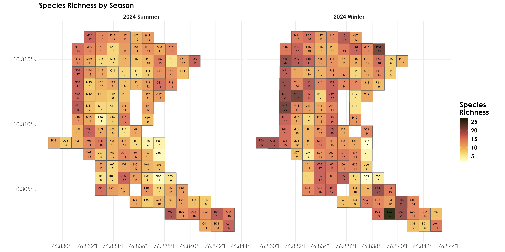

# Exploring point-count data  

In this script, we will explore the point-count data to understand bird species diversity patterns across seasons. For this analysis, we rely on two seasons of point-count data, that was carried out in June 2024 and Dec 2024.  

## Install required libraries
```{r}
library(tidyverse)
library(dplyr)
library(stringr)
library(vegan)
library(ggplot2)
library(scico)
library(data.table)
library(extrafont)
library(sf)
library(raster)

# for plotting
library(scales)
library(ggplot2)
library(ggspatial)
library(colorspace)
library(scico)
library(paletteer)

# Source any custom/other internal functions necessary for analysis
source("code/01_internal-functions.R")
```

## Loading point-count data
```{r}
# load two seasons of point-count data
point_counts <- read.csv("data/point-count-data.csv")

# removing all mammal species and unidentified bird species
point_counts <- point_counts %>%
  filter(birdMamm == "Bird")

# Using gsub to remove text within parentheses including the parentheses
point_counts$eBirdIndiaName2023 <- gsub("\\s*\\([^\\)]+\\)", "", point_counts$eBirdIndiaName2023)

# add species scientific name to the point-count data 
sci_name <- read.csv("data/species-taxonomy.csv")
sci_name$eBirdIndiaName2023 <- gsub("\\s*\\([^\\)]+\\)", "", sci_name$eBirdIndiaName2023)

# add scientific_name to the point_count data
point_counts <- left_join(point_counts[,-7], sci_name[,-c(1,2,4)])

# rename columns
names(point_counts)[4] <- "start_time"
names(point_counts)[7] <- "common_name"
names(point_counts)[12] <- "scientific_name"

# write to file
write.csv(point_counts, "results/cleaned-point-count-data.csv", row.names = F)
```

## Load site level information and create gridded data
```{r}
# we write a function below to create a grid around the centroid of each location of size 1ha
# the grid is primarily created for visualizing species richness & other associated metrics (this step is optional)

# function to create square grid around a point
create_square_grid <- function(lon, lat, size_ha = 1) {
  
  # convert hectares to degrees (approximate conversion)
  # 1 ha = 100m x 100m
  # at the equator, 1 degree is approximately 111,320 meters
  # so we need to convert 100m to degrees
  
  size_degrees <- sqrt(size_ha) * 100 / 111320
  
  # Create a square polygon
  coords <- matrix(c(
    lon - size_degrees/2, lat - size_degrees/2,  # bottom left
    lon + size_degrees/2, lat - size_degrees/2,  # bottom right
    lon + size_degrees/2, lat + size_degrees/2,  # top right
    lon - size_degrees/2, lat + size_degrees/2,  # top left
    lon - size_degrees/2, lat - size_degrees/2   # close the polygon
  ), ncol = 2, byrow = TRUE)
  
  # Create polygon
  pol <- st_polygon(list(coords))
  return(pol)
}

# function to obtain the latitude and longitude from a .csv file and create an associated shapefile
create_grid_shapefile <- function(csv_path, output_shp, lon_col = "longitude", lat_col = "latitude") {
  
  # read CSV file
  data <- read.csv(csv_path)
  
  # create list to store polygons
  polygons <- list()
  
  # create square grid for each point
  for(i in 1:nrow(data)) {
    polygons[[i]] <- create_square_grid(
      data[[lon_col]][i],
      data[[lat_col]][i]
    )
  }
  
  # convert to sf object
  grid_sf <- st_sf(
    # Include original data
    data,
    # Convert polygon list to geometry
    geometry = st_sfc(polygons, crs = 4326)
  )
  
  # write to shapefile
  st_write(grid_sf, output_shp, driver = "ESRI Shapefile", append = FALSE)
  
  return(grid_sf)
}

# site-level information
sites <- "data/sites.csv"
grid_shp <- "data/candura_grids.shp"

# Create the grid shapefile
grid_sf <- create_grid_shapefile(
  csv_path = sites,
  output_shp = grid_shp,
  lon_col = "decimalLongitude",  # replace with your longitude column name
  lat_col = "decimalLatitude"    # replace with your latitude column name
)
```

## Extract species-level information
```{r}
# estimate abundance across all species for each grid and season
abundance <- point_counts %>%
  group_by(gridID, common_name, seasonYear) %>% 
  summarise(abundance = sum(number)) %>%
  ungroup()

# unique species observed across seasons
# in summer 82 unique species were detected
summer_species <- abundance %>%
  filter(seasonYear == "2024 Summer") %>%
  distinct(common_name)

# 89 unique species were detected in the winter
winter_species <- abundance %>%
  filter(seasonYear == "2024 Winter") %>%
  distinct(common_name)

# overall list of unique species detected in point counts
# 107 unique species were detected across both seasons
pc_species <- abundance %>%
  group_by(common_name) %>%
  summarise(cumulative_abundance = sum(abundance)) %>%
  left_join(., sci_name[,-c(1,2,4)], 
            by = c("common_name" = "eBirdIndiaName2023")) %>%
  rename(., scientific_name = eBirdScientificName2023) %>%
  arrange(desc(cumulative_abundance))

# write to file
write.csv(pc_species, "results/species-in-point-counts.csv",
          row.names = F)

# total abundance by species for each season across grids
totAbundance_by_season <- abundance %>%
  group_by(common_name, seasonYear) %>%
  summarise(totAbundance = sum(abundance))

# species most abundant across seasons include the Yellow-browed Bulbul, Southern Hill Myna, Crimson-backed Sunbird, Greater Racket-tailed Drongo 

# estimate richness for point count data (calculated for each site)
richness <- abundance %>%
  mutate(forRichness = case_when(abundance > 0 ~ 1)) %>%
  group_by(gridID, seasonYear) %>%
  summarise(richness = sum(forRichness)) %>%
  ungroup()
```

## Visualizing richness data across seasons
```{r}
# First, join your species data with the spatial data
grid_with_richness <- grid_sf %>%
  left_join(richness, by = "gridID")

# Create the plot
fig_richness_by_season <- ggplot() +
  geom_sf(data = grid_with_richness, aes(fill = richness),
          alpha=0.9) +
  geom_sf_text(data = grid_with_richness, 
               aes(label = paste(gridID, "\n", richness)),
               size = 2) +
  facet_wrap(~seasonYear) +
  scale_fill_scico(palette = "lajolla")+
  theme_minimal() +
  labs(fill = "Species\nRichness",
       title = "Species Richness by Season") +
  theme(text = element_text(family = "Century Gothic", size = 14, face = "bold"),plot.title = element_text(family = "Century Gothic",
      size = 14, face = "bold"),
      plot.subtitle = element_text(family = "Century Gothic", 
      size = 14, face = "bold",color="#1b2838"),
      axis.title = element_blank())

ggsave("figs/fig_richness_by_season.png", plot = fig_richness_by_season, width = 14, height = 7, units = "in", 
       dpi = 300, bg = "white")
dev.off() 
```



## Visualizing abundance by species across seasons

```{r}
# join abundance data with the spatial data
grid_with_abundance <- grid_sf %>%
  left_join(abundance, by = "gridID")

# first, let's create a base grid that has all possible combinations
base_grid <- grid_with_abundance %>%
  dplyr::select(gridID, geometry) %>%
  distinct()

# get unique seasons
seasons <- unique(grid_with_abundance$seasonYear)

# create a complete grid with all combinations
complete_grid <- base_grid %>%
  crossing(seasonYear = seasons) %>%
  st_sf()

# get unique species list
species_list <- unique(grid_with_abundance$common_name)

# create PDF
pdf("figs/species_by_season_abundance.pdf", width = 14, height = 7)

# loop through each species
for(sp in species_list) {
  
  # get data for this species
  current_species_data <- grid_with_abundance %>%
    filter(common_name == sp) %>%
    dplyr::select(gridID, seasonYear, abundance) %>%
    st_drop_geometry()
  
  # join with complete grid
  plot_data <- complete_grid %>%
    left_join(current_species_data, by = c("gridID", "seasonYear"))
  
  # Create plot
  p <- ggplot() +
    geom_sf(data = plot_data, aes(fill = abundance),
            alpha = 0.9) +
    geom_sf_text(data = plot_data, 
                 aes(label = paste(gridID, "\n", 
                                   ifelse(is.na(abundance), 
                                          "0", abundance))),
                 size = 2) +
    facet_wrap(~seasonYear) +
  scale_fill_scico(palette = "lajolla",
                    na.value = "grey80")+
    theme_minimal() +
  theme(text = element_text(family = "Century Gothic", size = 14, face = "bold"),plot.title = element_text(family = "Century Gothic",
      size = 14, face = "bold"),
      plot.subtitle = element_text(family = "Century Gothic", 
      size = 14, face = "bold",color="#1b2838"),
      axis.title = element_blank()) +
    labs(fill = "Abundance",
         title = paste("Abundance of", sp, "by Season"))
  
  print(p)
}

dev.off()
```


